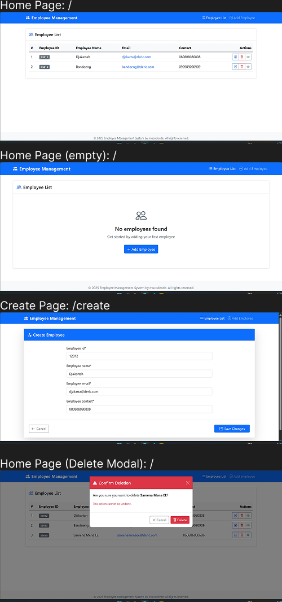

# Employee Management Web App

## Overview

**Employee Management Web App** is a web application used for CRUD operations for employee data.

## Features

### ✅ Current Features:
- CRUD (Create, Read, Update, Delete) operations for employee data

## Installation

To get started with the **Employee Management Web App**, follow these steps:

1. **Clone the repository:**

    ```bash
    git clone https://github.com/muhammadderic/crud-employee-management.git
    cd crud-employee-management
    ```

2. **Install dependencies:**

    ```bash
    pip install -r requirements.txt
    ```

3. **Run the development server:**

    ```bash
    python manage.py runserver
    ```

    Open [http://localhost:8000](http://localhost:8000) to view the application in your browser.

## Screenshots

<div style="display: flex; justify-content: space-between;">
    
</div>

*All interfaces of the Employee Management Web App*

## Technologies Used

- **Django** – A high-level Python web framework
- **Bootstrap** – Frontend component library for responsive design
- **django-crispy-forms** – Django utility for elegant form rendering
- **crispy-bootstrap5** – Bootstrap 5 template pack for django-crispy-forms

## Contributing

Contributions are welcome! If you'd like to contribute to this project, please follow these steps:

1. Fork the repository.
2. Create a new branch for your feature or bugfix.
3. Commit your changes and push your branch.
4. Open a pull request to have your changes reviewed.

## License

This project is licensed under the MIT License. See the [LICENSE](LICENSE) file for more details.

## Contact

If you have any questions or suggestions, feel free to reach out:

- **GitHub**: [muhammadderic](https://github.com/muhammadderic)